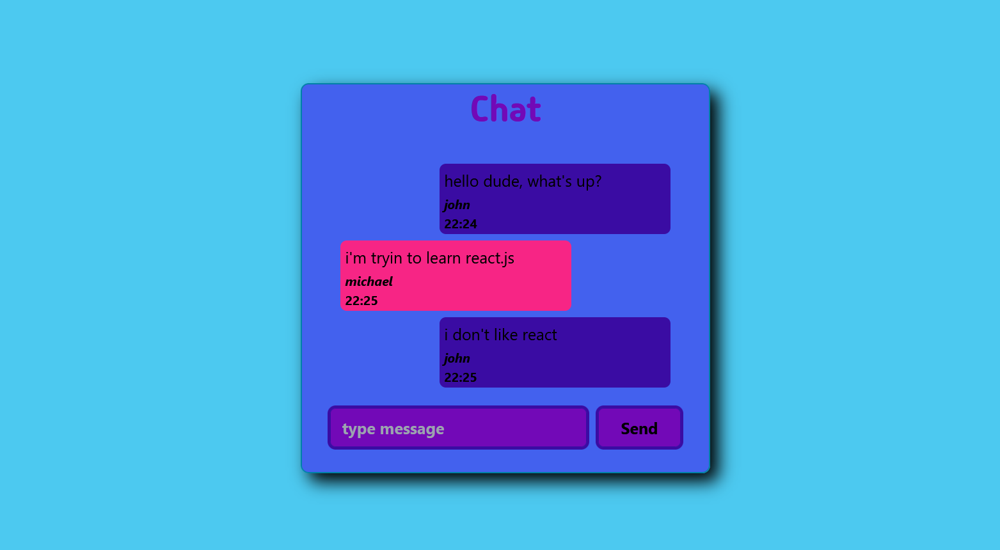

# Project Informations

## Features
This app has been prepared for typing to someone who located different browser tab. At the beginning, every user selects a nickname. If the users enter the same roomId, they will connect the same room to chat. The chat's text colors and positions can change depending on users. 

## Technologies, Libraries

In this react project, `socket.io` and `socket-cli.io` were used for data transference between client and server side.  `Express` package was integrated, also `cors` package was installed for preventing some unnecessary bugs and problems. The project's UI has been supported with `TailwindCss`.

## Install

1- Clone the project to your computer
2- Locate to server folder and use `npm install` command
3- Do the same thing for client folder
4- Execute the app with `npm start` command for client and server folders, both of them.

Note : You dont need to create tailwind config file, it already has been sent to repository.

